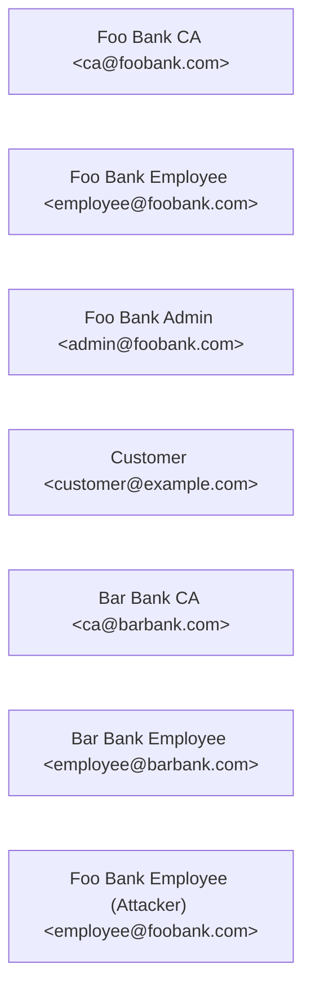
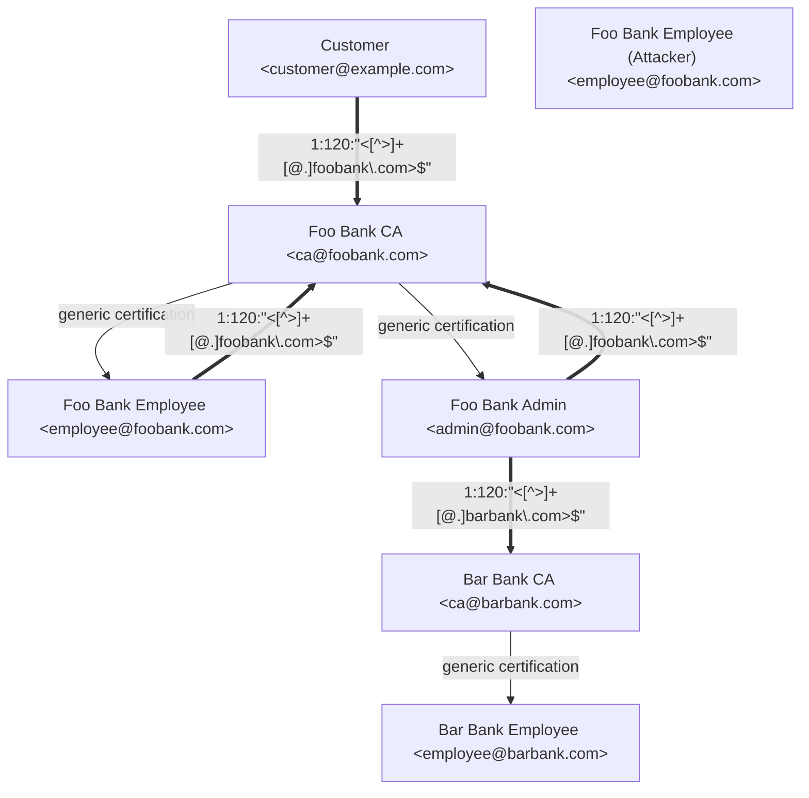

<!--
SPDX-FileCopyrightText: 2022 Paul Schaub <vanitasvitae@fsfe.org>

SPDX-License-Identifier: Apache-2.0
-->
# Test Vectors

## Freshly Generated Vectors

The `freshly_generated/` directory contains freshly generated test vectors.
Those are keys and certificates without any third-party signatures.

## Cross Signed Vectors
The `cross_signed/` directory contains test vectors that model the following interconnectivity:

## Useful Resources:
* https://mateam.net/html-escape-characters/
* https://docs.sequoia-pgp.org/sequoia_openpgp/regex/index.html#caveat-emptor